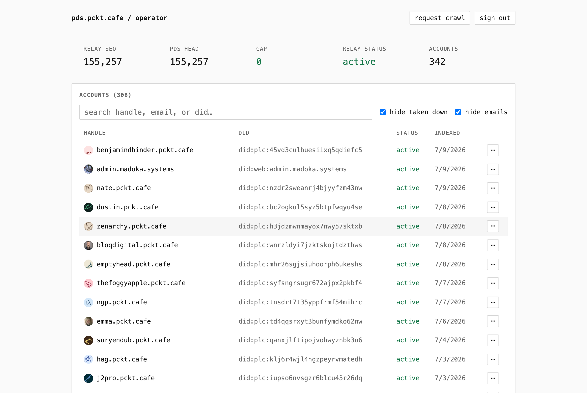
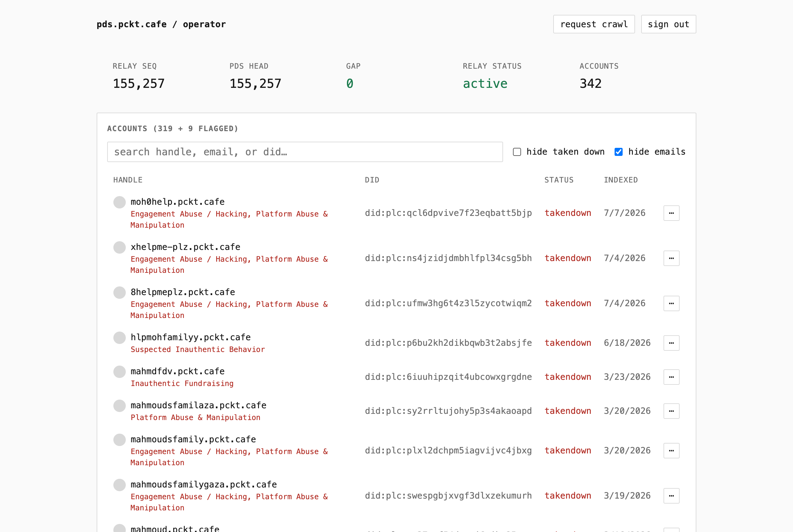
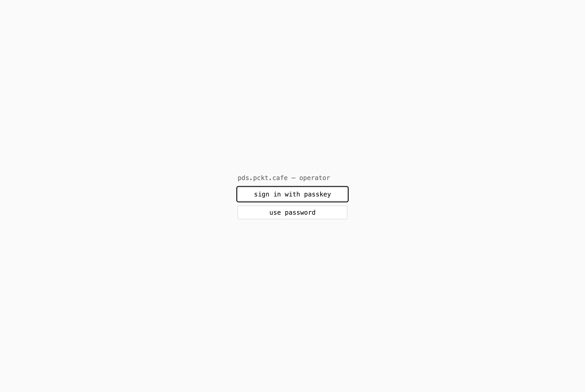
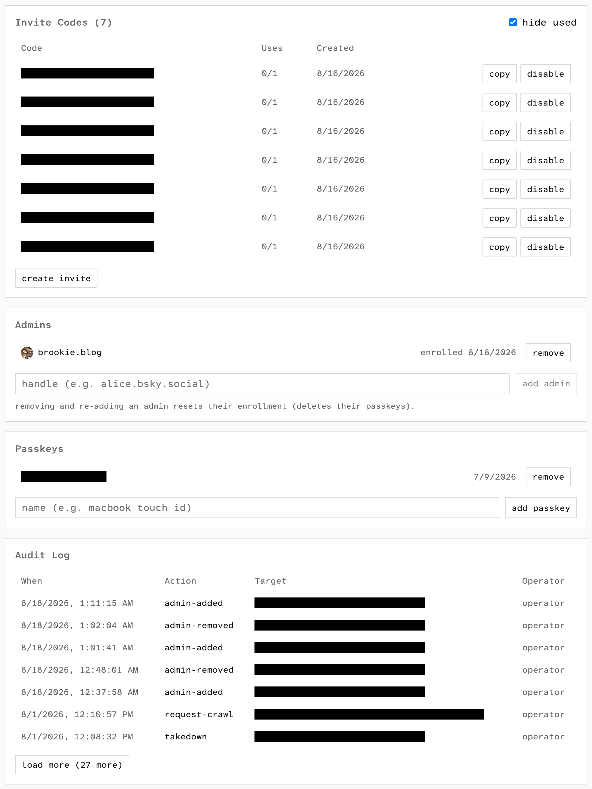

# PDS Operator

Self-hosted admin dashboard for an [atproto](https://atproto.com) PDS: account
list/search/takedown/enable/password-reset, moderation-labeler flags with Bluesky DM
alerts, relay sync status, invite codes, passkey sign-in, and an audit log. Talks to the
PDS and relay only over their public HTTPS APIs, no SSH/DB access required.



<p>
  
  
</p>



## How it works

The server keeps a local SQLite copy of everything in `server/data.sqlite`. A background
syncer does a full pass against the PDS on startup and every 15 minutes. Between passes
it stays subscribed to the PDS firehose and each labeler's label stream, so handle
changes, takedowns, and new labels land within seconds. Stream cursors survive restarts,
and dead sockets are detected and reconnected. Avatars and handle resolution go through
the PDS itself, not the Bluesky appview. Requests to outside services (label backfill)
are throttled and retried with backoff when rate limited. The SQLite file is a
rebuildable cache. The only data worth backing up is `server/audit.log`.

## Setup

```
cd web && npm install
cd ../server && npm install
npm run setup   # interactive, writes server/.env
```

The wizard asks for the PDS, relay, and DM alert config, generates a session secret, and
can start the server and mint a passkey enrollment link in one go. It can also generate
a fly.toml and print the fly.io deploy commands (optional, any host works). The operator password is optional. Leave it empty
for passkey-only sign-in, where enrollment links from the CLI are the only way in:

```
npm run enroll   # prints a single-use link + QR code, expires in 15 minutes
```

Run it again any time to enroll another device, or as recovery if all passkeys are lost
(shell access is the break-glass). To configure by hand instead, copy `.env.example` to
`server/.env` and generate the hash with
`node -e "console.log(require('bcryptjs').hashSync('<password>', 10))"`.

### Other PDS implementations

The reference PDS authenticates admin calls with `PDS_ADMIN_PASSWORD` over basic auth.
For implementations without an admin password, like
[tranquil-pds](https://tangled.org/tranquil.farm/tranquil-pds), set
`PDS_ADMIN_IDENTIFIER` to the handle of an account with admin rights and put that
account's password in `PDS_ADMIN_PASSWORD`. The dashboard then signs in as that account
and sends bearer tokens instead. Sign-in is headless, so use an app password or keep 2FA
off that account.

### Labelers

`server/labelers.json` (gitignored, copy `server/labelers.json.example`):

```json
[
  {
    "name": "skywatch blue",
    "did": "did:plc:e4elbtctnfqocyfcml6h2lf7",
    "labels": ["platform-manipulation", "engagement-abuse"]
  }
]
```

`labels` is the watchlist of label values that flag an account. Empty or omitted means
every label from that labeler counts. The endpoint is resolved from the labeler's DID
document and label names come from its published definitions. Changing the file requires
a restart.

Ozone quirk: `queryLabels` silently returns nothing past 20 `uriPatterns` per request,
so backfill batches are capped at 20.

### DM alerts

Set the four `NOTIFY_*` / `DASHBOARD_URL` values in `server/.env`: sender handle, an app
password created **with** DM access, recipient handle, and the dashboard URL for deep
links. The recipient has to accept DMs from the sender (follow them, or allow DMs from
everyone). Unset = disabled.

With DMs enabled you also get an alert when a single account creates a burst of records
(likely spam). The default fires at 500 record creations in 60 minutes, tune with
`ACTIVITY_ALERT_CREATES` and `ACTIVITY_ALERT_WINDOW_MINUTES`, disable with
`ACTIVITY_ALERT_CREATES=0`. At most one alert per account per window.

## Dev

```
cd web && npm run dev        # vite dev server, proxies /api to :8787
cd server && npm run dev     # fastify API on :8787
```

## Production

```
cd web && npm run build      # writes web/dist
cd server && npm run build && NODE_ENV=production npm start
```

The server serves `web/dist` alongside the API, so only the server process runs in
production.

- Run behind a TLS-terminating reverse proxy. HTTPS is required for passkeys (WebAuthn
  won't run in a non-secure context), and passkeys are per-hostname, so enroll fresh
  ones on the production domain.
- `NODE_ENV=production` enables the secure session cookie, binds to 127.0.0.1 (override
  with `HOST`), and refuses weak `SESSION_SECRET`s (`openssl rand -hex 32`).
- `trustProxy` is on: `req.ip` (login rate limiting) comes from X-Forwarded-For. Correct
  behind the proxy, spoofable if you expose the port directly.
- Set `DASHBOARD_URL` to the real URL and `chmod 600 server/.env`.
- Back up `server/audit.log` (`AUDIT_LOG_PATH` overrides the location).
- Run under a process supervisor. Sessions are in-memory, so a restart signs you out.

### Docker

```
cp .env.example .env                              # fill in per the comments
cp compose.example.yaml compose.yaml
docker compose up -d --build
docker compose exec app node dist/cli.js enroll   # passkey enrollment link (see Setup)
```

- The dashboard listens on `127.0.0.1:8787`, reachable only from the host. In production, put a
  TLS-terminating reverse proxy in front (HTTPS is required for passkeys). If the
  proxy is another compose service, remove the `ports:` block and point it at
  `app:8787`.
- Data persists in the `app-data` volume across rebuilds and updates. To back up the
  audit log, do: `docker compose cp app:/data/audit.log .`, or you can switch to a bind mount
  (see comment in `compose.example.yaml`).
- To watch your own labelers, edit `server/labelers.json` (copy the example) then
  rebuild, or bind mount it (commented line in the compose file) so a restart is
  enough.
- Use the enroll command above, not `npm run enroll`. dev tooling isn't in the
  image.
